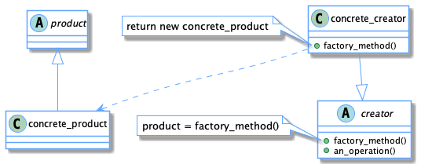

| [Home](home.md) | [News](news.md) | [Gallery](gallery.md) | [Examples](examples.md) | [Downloads](downloads.md) | [Documentation](documentation.md) | [Sources](https://github.com/gammasoft71/xtd) | [Project](https://sourceforge.net/projects/xtdpro/) | [Gammasoft](gammasoft.md)  | [Contact](contact.md) | [Website](https://gammasoft71.wixsite.com/xtdpro) |

# Factory Method

The Factory Method design pattern defines an interface for creating an object, but let subclasses decide which class to instantiate. This pattern lets a class defer instantiation to subclasses.

Usage          High

## UML class diagram

A visualization of the classes and objects participating in this pattern.



## Sample code

This structural code demonstrates the Factory method offering great flexibility in creating different objects. The Abstract class may provide a default object, but each subclass can instantiate an extended version of the object.

```c++

```

## Output

```

```

## See also
​
* [Common Design Patterns](common_design_patterns.md)
* [Design Guidelines](design_guidelines.md)
* [Documentation](documentation.md)

______________________________________________________________________________________________

© 2022 Gammasoft.
