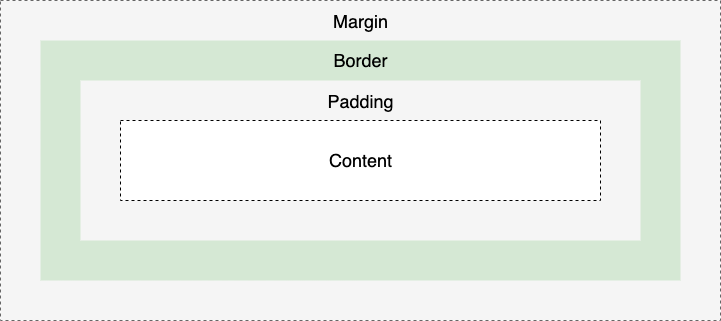

| [Home](home.md) | [News](news.md) | [Gallery](gallery.md) | [Examples](examples.md) | [Downloads](downloads.md) | [Documentation](documentation.md) | [Support](support.md) | [Sources](https://github.com/gammasoft71/xtd) | [Project](https://sourceforge.net/projects/xtdpro/) | [Gammasoft](gammasoft.md) | [Website](https://gammasoft71.wixsite.com/xtdpro) |

# Style sheets box model

In xtd, the term "box model" is used when talking about design and layout.

The xtd box model is essentially a box that wraps around every [xtd::forms::control](https://codedocs.xyz/gammasoft71/xtd/classxtd_1_1forms_1_1control.html) item.
It consists of: margins, borders, padding, and the actual content. The image below illustrates the box model:



Explanation of the different parts:

* **Content** - The content of the box, where text and images appear
* **Padding** - Clears an area around the content. The padding is transparent
* **Border** - A border that goes around the padding and content
* **Margin** - Clears an area outside the border. The margin is transparent

The box model allows us to add a border around elements, and to define space between elements. 

## Example

Demonstration of box model with css :

```css
control {
  width: 300px;
  border: 15px solid green;
  padding: 50px;
  margin: 20px;
}
```

## Width and Height of an Element

In order to set the width and height of an [xtd::forms::control](https://codedocs.xyz/gammasoft71/xtd/classxtd_1_1forms_1_1control.html) correctly, you need to know how the box model works.

## Important

When you set the width and height properties of an element with CSS, you just set the width and height of the **content area**. 
To calculate the full size of an element, you must also add padding, borders and margins.

# Exmple

This [xtd::forms::control](https://codedocs.xyz/gammasoft71/xtd/classxtd_1_1forms_1_1control.html) will have a total width of 350px: 

```css
control {
  width: 320px;
  padding: 10px;
  border: 5px solid gray;
  margin: 0; 
}
```

The total width of an element should be calculated like this:

Total element width = width + left padding + right padding + left border + right border + left margin + right margin

The total height of an element should be calculated like this:

Total element height = height + top padding + bottom padding + top border + bottom border + top margin + bottom margin

# See also
​
* [Style sheets reference](guide_style_sheets_reference.md)
* [Guides](guides.md)
* [Documentation](documentation.md)

______________________________________________________________________________________________

© 2022 Gammasoft.
