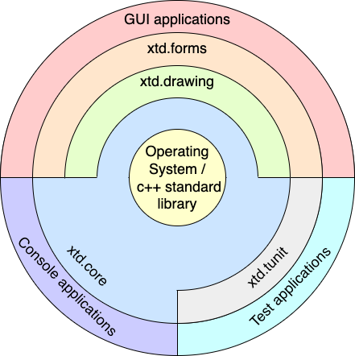

| [Home](home.md) | [News](news.md) | [Gallery](gallery.md) | [Examples](examples.md) | [Downloads](downloads.md) | [Documentation](documentation.md) | [Support](support.md) | [Sources](https://github.com/gammasoft71/xtd) | [Project](https://sourceforge.net/projects/xtdpro/) | [Gammasoft](gammasoft.md) | [Website](https://gammasoft71.github.io/xtd) |

(*) See [portability](portability.md#the-xtd-libraries-portability-list) for more information.

# Latest news

* [The new xtd website is online - February 9, 2023](news.md#the-new-xtd-website-is-online-february-9-2023)
* [xtd.tunit is compatible with Test Explorer window of Visual Studio 2019 or later - November 18, 2022](news.md#xtdtunit-is-compatible-with-test-explorer-window-of-visual-studio-2019-or-later-november-18-2022) 
* [Release xtd 0.1.0 (beta) - October 10, 2021](news.md#release-xtd-010-beta-october-10-2021) 

## Features

* Free and open-source ([MIT License](https://github.com/gammasoft71/xtd/blob/master/docs/license.md));
* a collection of native C++ classes libraries, to complete std;
* API close to the .net API with a modern C++ approach and full integration with the std standard;
* written in efficient, modern C++17/20 with [RAII](https://en.wikipedia.org/wiki/Resource_acquisition_is_initialization) programming idiom;
* and [highly portable](portability.md#the-xtd-libraries-portability-list) and available on [many different platforms](portability.md#operating-system-supported);

## xtd libraries architecture

xtd is composed of several libraries grouped by package.

### system

The [xtd.core](https://gammasoft71.github.io/xtd/reference_guides/latest/group__xtd__core.html) library is modern C++17/20 libraries of classes, interfaces, and value types that provide access to system functionality. It is the foundation on which c++ applications, components, and controls are built.

### drawing

The [xtd.drawing](https://gammasoft71.github.io/xtd/reference_guides/latest/group__xtd__drawing.html) library contains types that support basic GDI+ graphics functionality. Child namespaces support advanced two-dimensional and vector graphics functionality, advanced imaging functionality, and print-related and typographical services. A child namespace also contains types that extend design-time user-interface logic and drawing.

### forms

The [xtd.forms](https://gammasoft71.github.io/xtd/reference_guides/latest/group__xtd__forms.html) library contains classes for creating Windows-based applications that take full advantage of the rich user interface features available in the Microsoft Windows, Apple macOS and linux base operating system.

### tunit

The [xtd.tunit](https://gammasoft71.github.io/xtd/reference_guides/latest/group__xtd__tunit.html) library is a unit-testing framework for modern C++17/20, inspired by [Microsoft.VisualStudio.TestTools.Cpp](https://docs.microsoft.com/en-us/visualstudio/test/microsoft-visualstudio-testtools-cppunittestframework-api-reference).

See [xtd libraries hierarchy](hierarchy.md).

# Objectives and Mission

* xtd is a powerful, yet easy to use platform to build your applications upon
* xtd is modular and scalable from embedded applications
* xtd provides consistent, comprehensive and comprehensible programming interfaces
* xtd favors simplicity over complexity ("as simple as possible, but not simpler")
* xtd aims for consistency in [design](https://github.com/gammasoft71/xtd/blob/master/docs/documentation.md), [coding style](https://github.com/gammasoft71/xtd/blob/master/docs/coding_conventions_guidelines.md) and [documentation](https://gammasoft71.github.io/xtd/reference_guides/latest/index.html)
* xtd emphasizes source code quality, in terms of readability, comprehensiveness, consistency, style and testability
* xtd aims to make C++ programming fun again Guiding Principles
* Strong focus on code quality, style, consistency and code readability – all code must satisfy our [coding style guide](https://github.com/gammasoft71/xtd/blob/master/docs/design_guidelines.md)
* Strong focus on tests (automated [unit tests](https://github.com/gammasoft71/xtd/tree/master/tests) with high coverage)
* Build on top of solid foundations – use existing proven C, C++ or Objective-C libraries (e.g. Win32 APi, Gtk4, AppKit,...) where it makes sense

# Getting Started

* [Installation](downloads.md) provides download and install documentation.
* [Guides](guides.md) provides xtd guides and tutorials.
* [Examples](../examples/README.md) provides over 700 examples to help you use xtd, grouped by libraries and topics.

______________________________________________________________________________________________

© 2023 Gammasoft.
