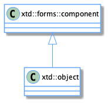
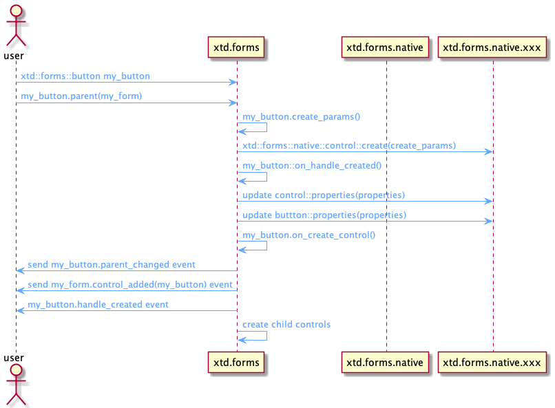

# xtd.forms explanations (**Internal use only**)

## Table of contents
* [Libraries and API](#libraries-and-api)
  * [xtd.forms hierarchy diagram](#xtdforms-hierarchy-diagram)
  * [xtd.forms high level API](#xtdforms-high-level-api)
  * [xtd.forms.native low level API](#xtdformsnative-low-level-api)
* [Components](#components)
  * [Component type](#component-type)
  * [Component class diagram](#component-class-diagram)
  * [Component objects](#component-objects)
* [Controls](#controls)
  * [Control type](#control-type)
  * [Control class diagram](#control-class-diagram)
  * [Control objects](#control-objects)
* [Parent and childs](#parent-and-childs)
  * [Add parent](#add-parent)
  * [Remove parent](#remove-parent)
  * [Update parent](#update-parent)
* [Control operations](#control-operations)
  * [Create control](#create-control)
  * [Update control](#update-control)
  * [Remove control](#remove-control)
* [Containers](#containers)
  * [Scrollables](#scrollables)
  * [Layauts](#layauts)
* [Forms](#forms)
  * [Form](#form)
  * [MDI and child](#mdi-and-child)
  * [dialog](#dialog)
* [Events](#events)
  * [Virtual and event](#virtual-and-event)
  * [Keyboard](#keyboard)
  * [Mouse](#mouse)
  * [Paint](#paint)
  * [Other Events](#other-events)
* [Graphics](#graphics)
* [Sizes](#sizes)
* [Ambient properties](#ambient-properties)
* [Dock and anchor](#dock-and-anchor)
* [Themes](#themes)
  * [Control style](#control-style)
  * [Dialog style](#dialog-style)
* [Resources](#resources)
* [Settings](#settings)

## Libraries and API

Like the whole [xtd framework](xtd_explanations.md), **xtd.forms** provides a high level API for the user and uses a low level API to communicate, in this case, with a graphical toolkit:
 * **xtd.forms** : high level API.
 * **xtd.forms.native** : low level API.

### xtd.forms hierarchy diagram


### xtd.forms high level API

**xtd.forms** offers all the advantages of an API in modern C++ 17/20.

**xtd.forms** contains a large amount of objects such as: 
 * components
 * controls
 * containers
 * forms
 * dialogs
 * and many more  

**xtd.forms** has its own design, its own hierarchy and its own nomenclature.

**xtd.forms** handles all the high level functionality without going through the **xtd.forms.native** API. However, as soon as **xd.froms** needs to access a (native) system resource like creating a control, it will use the **xtd.forms.native** API.

### xtd.forms.native low level API

**xtd.forms.native** provides a low level API through static functions grouped by themes.

The role of this API is the same as that of the Java JVM API or the Common Language Runtime (CLR) of the .Net Framework.

The structure is still the same as for **xtd.native** or **xtd.drawing.native** :

Static functions contained in static classes like this :

```c++
namespace xtd {
  namepsace forms {
    class control static_ {
    protected:
      static intptr_t create(const create_params& create_params);
      // ...
    };
  }
}
```

or this :

```c++
namespace xtd {
  namepsace forms {
    class button static_ {
    protected:
      static void set_default_button(intptr_t control);
    };
  }
}
```

**Remarks :** All methods are protected. This allows to forbid a user to call one of these functions.

**xtd.forms.native** is an interface library, there are no implementations and therefore no source files.

Only headers with function declarations.

**xtd.forms.native** does not know the objects of **xtd.forms** because it is used by **xtd.forms** and not the other way around.

By design, it does not know the objects of **xtd.forms.native.xxx**. Since the purpose of this interface is to completely isolate the **xtd.forms** and **xtd.forms.native.xxx** libraries.

On the other hand **xtd.forms.native** knows the objects of **xtd.core** and **xtd.drawing** since it uses them.

All the objects of **xtd.forms.native.xxx** are transformed in intptr_t.

For example :

For using the function **set_default_button**

**xtd.forms.native** defines it as follows:

```c++
void xtd::forms::native::button::set_default_button(intptr_t control);
```

**xtd.form** uses it as follows:

```c++
void xtd::forms::form::set_default_button(const xtd::forms::form::button& button) {
  xtd::forms::native::button::set_default_button(button.handle());
}
```

**xtd.form.native.xxx** implements it as follows:

```c++
void xtd::forms::native::button::set_default_button(intptr_t control) {
  reinterpret_cast<Toolkit::Button*>(control)->SetDefaultBuutton(true);
}
```

**Remarks :** The **xxx** of the library **xtd.forms.native.xxx** can be replaced by **wxwdigets**. End in tthe future by **qt6** or **sdl2** or others.

## Components

### Component type

A componant provides the base implementation and enables object sharing between applications.

A component is an integral part of xtd.forms but unlike a control, a component has no graphical interface.

It will be mainly used in the future with the xtd-code<sup>1</sup> designer

<sup>1</sup> xtd-code : code editor and designer for xtd.

### Component class diagram



All controls inherit from component.

### Component objects

There are several components in **xtd.forms** : xtd::forms::timer, xtd::forms::background_worker, ...

## Controls

### Control type

Defines the base class for controls, which are components with visual representation.

Unlike a component, a control always has a graphic interface.

### Control class diagram


The control class provides all properties, functions and events common to the different controls. It also provides some static functions to manipulate the controls.

### Control objects

The controls do not have the same completeness. They could be classified in different categories like this:

* Simple controls : xtd::forms::label, xtd::forms::button, xtd::forms::text_box, ...
* List controls : xtd::forms::combo_box, xtd::forms::list_box, ...
* Picker controls : xtd::forms::color_picker, xtd::forms::date_time_picker, ...
* Complex controls : xtd::forms::list_view, xtd::forms::tree_view, xtd::forms::rich_text_box, ...

## Parent and childs

All controls must have a parent, except **xtd::forms::form** which cannot have one (An exception **xtd::invalid_operation_exception** will be generated if you try).

A control must always have one and only one parent (except for xtd::forms::form which can't have any). But a parent can have several child controls.

Any control can be a parent or a child. There are no restrictions.

It is easy to imagine that a complex control needs several simple controls.
Like for example xtd::forms::domain_up_down is composed of an xtd::forms::text_box and an xtd::forms::up_down_button.
And that an xtd::forms::form or an xtd::forms::panel can contain an xtd::forms::domain_up_down. 
In this case our xtd::forms::domain_up_down is a parent for xtd::forms::text_box and xtd::forms::up_down_button and at the same time is a child for xtd::forms::form or xtd::forms::panel.

You can retrieve or assign a parent to a control using the **xtd::forms::control::parent** property or by assigning the control to the parent by adding it to the **xtd::forms::control::controls** collection.

A collection of controls is a particular collection, it is an **xtd::froms::layout::arranged_element_collection**.

This collection has the particularity to have [events](../tutorial_events.md) on which we can connect:

* item_added : occurs when an item is added to the collection.
* item_updated : occurs when an item is updated in the collection.
* item_erased: occurs when an item is deleted from the collection.

### Add parent

With this collection we can write indifferently to add **my_form** as a perent to **my_button** :

```c++
my_button.parent(my_form);
```

Or 

```c++
my_form.controls().push_back(my_button);
```

Globally behind the function **my_button.parent(my_form)**, we call the function : **my_form.controls().push_back(my_button)**. And an **item_added** event will be generated.

### Remove parent

In the same way, to dissociate a control from a parent or simply to remove a control from the collection of controls of a parent it is enough to call indifferently:

```c++
my_button.parent(nullptr);
```

or

```c++
my_form.controls().erase(my_button);
```

Globally behind the function **my_button.parent(nullptr)**, we call the function : **my_form.controls().erase(my_button)**. And an **item_removed** event will be generated.

### Update parent

You can decide at any time to change the parent of a control. A control could very well go from a form to a dialog for example.

In this case, if previously **my_button** was assigned the form **my_form** as parent :

```c++
my_button.parent(my_form);
```

Then we can decide to change the parent of my_button like this:

```c++
my_button.parent(my_dialog);
```

or this :

```
my_dialog.controls().push_back(my_button)
```

Globally behind the function **my_button.parent(my_dialog)**, we call the function : **my_form.controls().erase(my_button)**, and **my_dialog.controls().push_back(my_button)**. An **item_removed** event will be generated for **my_form** and an **item_added** event for my_dialog.

## Control operations

We can do different operations on a control:
* Create the control.
* Update the properties of the control.
* Delete the control.
* We can also retrieve the different values of the properties and its status. But for this last operation we only read the internal information of the control.

### Create control

The creation of a control is a bit special. 
Indeed, when you create a control like for example:

```c++
xtd::forms::button my_button;
```

The control is created and can be manipulated but the control as a system resource (i.e. the native toolkit object) is not created.

The native control will only be created when it is assigned a parent. 
Except for the control xtd::forms::form which creates directly the system resource (i.e. the native toolkit object) in its constructor.
 
The creation of a control is done in several steps and exchanges between the different libraries.

#### Sequence diagram of the creation of a control

Here is the sequence diagram of the creation of an xtd::form::form.


Here is the sequence diagram of the creation of an xtd::form::button.



### Update control

### Remove control

## Containers

### Scrollables

### Layauts

## Forms

### Form

### MDI and child

### Dialog

## Events

### Virtual and event

### Keyboard

### Mouse

### Paint

### Other Events

## Graphics

## Sizes

## Ambient properties

## Dock and anchor

## Themes

### Control style

### Dialog style

## Resources

## Settings
