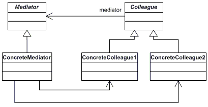

| [Home](home.md) | [News](news.md) | [Gallery](gallery.md) | [Examples](examples.md) | [Downloads](downloads.md) | [Documentation](documentation.md) | [Support](support.md) | [Sources](https://github.com/gammasoft71/xtd) | [Project](https://sourceforge.net/projects/xtdpro/) | [Gammasoft](gammasoft.md) | [Website](https://gammasoft71.wixsite.com/xtdpro) |

# Mediator

The Mediator design pattern defines an object that encapsulates how a set of objects interact. Mediator promotes loose coupling by keeping objects from referring to each other explicitly, and it lets you vary their interaction independently.

Usage          Medium-low

## UML class diagram

A visualization of the classes and objects participating in this pattern.



## Sample code

This structural code demonstrates the Mediator pattern facilitating loosely coupled communication between different objects and object types. The mediator is a central hub through which all interaction must take place.

```cpp

```

## Output

```

```

## See also
​
* [Common Design Patterns](common_design_patterns.md)
* [Design Guidelines](design_guidelines.md)
* [Documentation](documentation.md)

______________________________________________________________________________________________

© 2023 Gammasoft.
