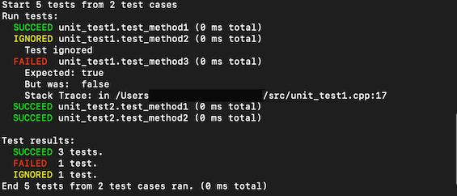
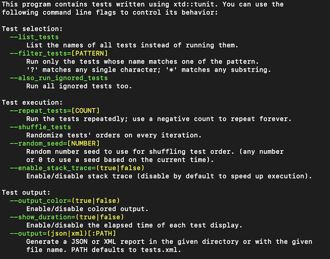
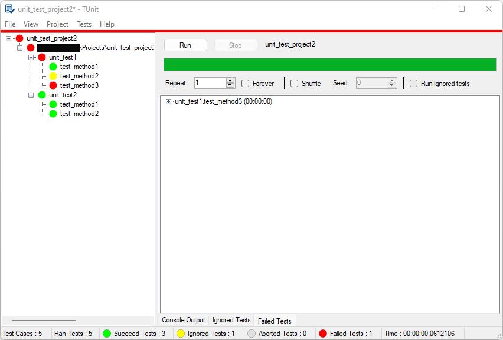
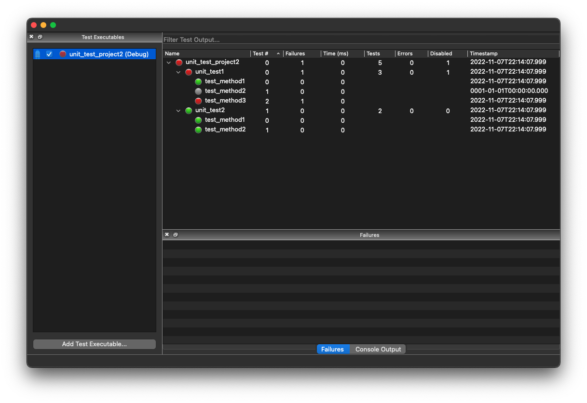

| [Home](home.md) | [News](news.md) | [Gallery](gallery.md) | [Examples](examples.md) | [Downloads](downloads.md) | [Documentation](documentation.md) | [Support](support.md) | [Sources](https://github.com/gammasoft71/xtd) | [Project](https://sourceforge.net/projects/xtdpro/) | [Gammasoft](gammasoft.md) | [Website](https://gammasoft71.github.io/xtd) |

# xtd.tunit overview

This topic shows how to create a simple [xtd.tunit](https://gammasoft71.github.io/xtd/reference_guides/latest/group__xtd__tunit.html) project and how to run it from the command line, with Visual Studio Test Explorer or external tools.

For this we will use a simple test.

## Sources

* src/unit_test1.cpp :

```cpp
#include <xtd/xtd.tunit>

using namespace xtd::tunit;

namespace unit_test_project2 {
  class test_class_(unit_test1) {
  public:
    void test_method_(test_method1) {
      assert::is_true(true);
    }

    void ignore_test_method_(test_method2) {
      assert::is_true(true);
    }

    void test_method_(test_method3) {
      assert::is_true(false);
    }
  };

  class test_class_(unit_test2) {
  public:
    void test_method_(test_method1) {
      assert::is_true(true);
    }

    void test_method_(test_method2) {
      assert::is_true(true);
    }
  };
}
```

* CMakeLists.txt :

```makefile
cmake_minimum_required(VERSION 3.3)

# Project
project(unit_test_project2)
find_package(xtd REQUIRED)
add_sources(
  src/unit_test1.cpp
)
target_type(TEST_APPLICATION)

# Install
install_component()
```

## Console

You can execute your [xtd.tunit](https://gammasoft71.github.io/xtd/reference_guides/latest/group__xtd__tunit.html) project in command line.

### On Windows

Run "Command prompt", go to the buid directory of the project (`unit_test_project2\build\Debug`) and type the following line :

```shell
unit_test_rpoject2
```

### On macOS and Linux

Run "Terminal", go to the buid directory of the project (`unit_test_project2/build/Debug`) and type the following line :

```shell
./unit_test_rpoject2
```

### Output

[](tunit_overview.md)

### Options

You can use the following command line flags to control its behavior. Type `unit_test_rpoject2 --help` for list the command line flags.

### Output

[](tunit_overview.md)

## Visual Studio Explorer

You can run your [xtd.tunit](https://gammasoft71.github.io/xtd/reference_guides/latest/group__xtd__tunit.html) project by using the Test Explorer window of Visual Studio 2019 or later. 

For more information about using Test Explorer, see [Run unit tests with Test Explorer](https://learn.microsoft.com/en-us/visualstudio/test/run-unit-tests-with-test-explorer?view=vs-2022).

[](tunit_overview.md)

### Remarks

* Make sure that the [Test Adapter for Google Test](https://learn.microsoft.com/en-us/visualstudio/test/how-to-use-google-test-for-cpp?view=vs-2022) tool is installed. It should be installed by default.

## tunit-gui

The tunit-gui tool (not ready yet, only a [c# prototype](https://github.com/gammasoft71/tunit_gui_win_forms) exists for the moment), can run [xtd.tunit](https://gammasoft71.github.io/xtd/reference_guides/latest/group__xtd__tunit.html) project.

[](tunit_overview.md)

## Other unit tests GUI tools

[xtd.tunit](https://gammasoft71.github.io/xtd/reference_guides/latest/group__xtd__tunit.html) is compatible with google-test (gtest). So any thirdparty unit tests GUI tool written for gtest can execute [xtd.tunit](https://gammasoft71.github.io/xtd/reference_guides/latest/group__xtd__tunit.html) project.

For example the [gtest-runner](https://github.com/nholthaus/gtest-runner) tool can run your [xtd.tunit](https://gammasoft71.github.io/xtd/reference_guides/latest/group__xtd__tunit.html) project.

[](tunit_overview.md)

## List of known IDE/tools compatible with xtd.tunit

* [Microsoft Vusial Studio 2019 or later](https://learn.microsoft.com/en-us/visualstudio/test/improve-code-quality?view=vs-2022)
* [gtest-runner](https://github.com/nholthaus/gtest-runner)
* [gtest-gbar](https://github.com/ospector/gtest-gbar)

## List of known IDE/tools NOT compatible with xtd.tunit

* [QtCreator](https://github.com/qt-creator/qt-creator) : The "QtCreator Tools Tests" does not work because it analyzes the source files to detect Google Test macros like (`TEST`, `GTEST_SUITE`, ...).

### Remarks

* Other third party IDE / tools could also run [xtd.tunit](https://gammasoft71.github.io/xtd/reference_guides/latest/group__xtd__tunit.html) projects but have not been tested.
* If you have a working IDE/tool, feel free to make a [pull request](https://github.com/gammasoft71/xtd) to update the list of compatible tools.
* If you have an IDE/tool that doesn't seem to be working, don't hesitate to ask for [support](https://gammasoft71.github.io/xtd/docs/Support).

## Next step

* Read [Writing test application tutorial](https://github.com/gammasoft71/xtd/blob/master/docs/writing_applicaion_test.md)
* Read [xtd.tunit examples](https://github.com/gammasoft71/xtd/blob/master/examples/xtd.tunit.examples/README.md).

# See also
​
* [Guides](guides.md)
* [Documentation](documentation.md)

______________________________________________________________________________________________

© 2023 Gammasoft.
