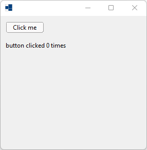
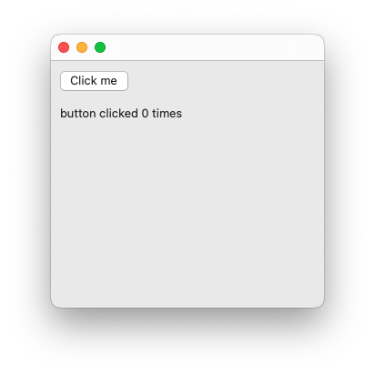
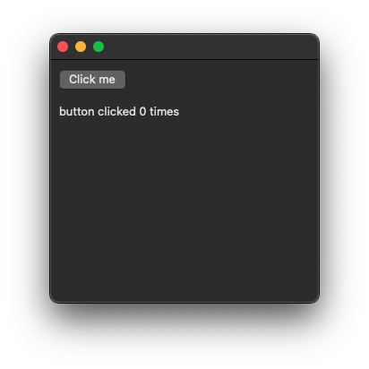
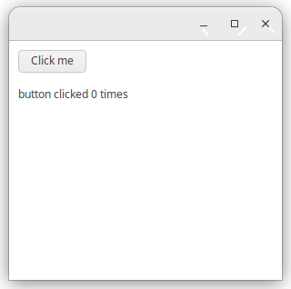
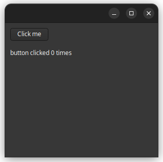

# control_with_name_operator

shows how to use [xtd::forms::control::name](https://gammasoft71.github.io/xtd/reference_guides/latest/classxtd_1_1forms_1_1control.html#a4ae2e76ab88ca4f8a08c4280d4ea639a) property and [xtd::forms::layout::arranged_element_collection::operator\[\]](https://gammasoft71.github.io/xtd/reference_guides/latest/classxtd_1_1forms_1_1control_1_1control__collection.html#ac25fcb076d440f3867c26c45001920c9) name operator.

# Sources

* [src/control_with_name_operator.cpp](src/control_with_name_operator.cpp)
* [CMakeLists.txt](CMakeLists.txt)

# Build and run

Open "Command Prompt" or "Terminal". Navigate to the folder that contains the project and type the following:

```shell
xtdc run
```

# Output

## Windows :




## macOS :





## Gnome :




